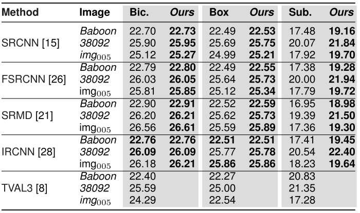

## Robust Single-Image Super-Resolution via CNNs and TV-TV Minimization ##

Matlab code to reproduce the experiments in

**[Robust Single-Image Super-Resolution via CNNs and TV-TV Minimization](https://arxiv.org/abs/2004.00843)** 
  Marija Vella, João F. C. Mota 
  submitted, 2020

Part of this work can be found in 

**[Single Image Super-Resolution via CNN Architectures and TV-TV Minimization](https://arxiv.org/abs/1907.05380)** 
  Marija Vella, João F. C. Mota 
  BMVC 2019
  
### Overview ###

Super-resolution (SR) constructs a high-resolution (HR) image from a low-resolution (LR) image. Convolutional neural networks (CNNs) are currently the state-of-the-art technique for SR, but they fail to guarantee consistency between the LR and the HR images. Our method adds a post-processing step, which solves an optimization problem called TV-TV minimization, that enforces consistency.

### Proposed Method ###

Diagram of our method: 

Given a low-resolution image b and the corresponding super-resolved output w from a SR method, e.g., a CNN, the proposed post-processing step not only adds robustness (to operator mismatches), but also systematically improves the quality of w. It achieves that by solving TV-TV minimization:

## Single-Image Super-Resolution ##

We consider three models for SR degradation, i.e., the process that transforms a high-resolution image into a low-resolution:

**Subsampling** - A contains rows of the identity matrix.

**Bicubic interpolation** - matrix A applies a blur followed by sub-sampling.

**Box filtering** - A is a convolutional filter.

### Test Sets ###

The ground truth images used in all experiments were obtained <a href="https://github.com/jbhuang0604/SelfExSR">here</a>, and can also be found in the following links
 
 * <a href="https://drive.google.com/open?id=1QSNW3QWPThBC1eGTi8k9ArzpNOd4U1nT">Set5 Dataset</a>

 
 * <a href="https://drive.google.com/drive/folders/1whyUJwPvXQ7O5QmTxY7nR-5jWtIHuz8w?usp=sharing">Set14 Dataset</a>

 
 * <a href="https://drive.google.com/drive/folders/19vNKVva2Pi3IZ-S60OLD0DhuCVSIQhmB?usp=sharing">BSD100 Dataset</a>

 
 * <a href="https://drive.google.com/drive/folders/1UkMAWA-D-njV3jVodJVFFwspGl6zQeYP?usp=sharing">Urban100 Dataset</a>

 
 ### Base Methods ###
 
For a fair comparison, most experiments were conducted assuming a bicubically interpolated LR image b similar to most methods. We compare our method with the following state-of-the-art SR methods:

 | Method | Citation|
 |---- | ---|
 |**SRCNN**| C. Dong, C. C. Loy, K. He, X. Tang "Learning a Deep Convolutional Network for Image Super-Resolution, ECCV 2014. Code available [here](http://mmlab.ie.cuhk.edu.hk/projects/SRCNN.html).|
 |**FSRCNN**| C. Dong, C. C. Loy and X. Tang, "Accelerating the Super-Resolution Convolutional Neural Network", ECCV 2016. Code available [here](http://mmlab.ie.cuhk.edu.hk/projects/FSRCNN.html).|
 |**DRCN**| J. Kim, J. K. Lee and K. M. Lee, "Deeply-Recursive Convolutional Network for Image Super-Resolution", CVPR 2016. Code available [here](https://cv.snu.ac.kr/research/DRCN/).| 
 |**VDSR**| J. Kim, J. K. Lee and K. M. Lee, "Accurate Image Super-Resolution Using Very Deep Convolutional Networks", CVPR 2016. Code available [here](https://cv.snu.ac.kr/research/VDSR/).| 
 |**LapSRN**| W. Lai, J. Huang, N. Ahuja and M. Yang, "Fast and Accurate Image Super-Resolution with Deep Laplacian Pyramid Networks", CVPR 2017. Code available [here](http://vllab.ucmerced.edu/wlai24/LapSRN/).| 
 |**SRMD**| K. Zhang, W. Zuo and L. Zhang, "Learning a Single Convolutional Super-Resolution Network for Multiple Degradations", CVPR 2018. Code available [here](https://github.com/cszn/SRMD).| 
 |**IRCNN**| K. Zhang, W. Zuo, G. Shuhang and L. Zhang, "Learning Deep CNN Denoiser Prior for Image Restoration", CVPR 2017. Code available [here](https://github.com/cszn/IRCNN).| 
 |**EDSR**| B. Lim, S. Son, H. Kim, S. Nah, K. M. Lee, "Enhanced Deep Residual Networks for Single Image Super-Resolution", CVPR 2017. Code available [here](https://github.com/sanghyun-son/EDSR-PyTorch).| 
 |**RCAN**|  Y. Zhang, K. Li, K. Li, L. Wang, B. Zhong and Y. Fu, "Image Super-Resolution Using Very Deep Residual Channel Attention Networks", ECCV 2018. Code available [here](https://github.com/yulunzhang/RCAN).| 
 |**ESRGAN**| X. Wang, K. Yu, S. Wu, J.Gu, Y. Liu, C.Dong, Y. Qiao and C .C. Loy, "ESRGAN: Enhanced Super-Resolution Generative Adversarial Networks", ECCVW 2018. Code available [here](https://github.com/xinntao/ESRGAN).| 
 
For SRCNN and SelfExSR, we used output images available [here](https://github.com/jbhuang0604/SelfExSR). Some of the images used as side information w, are also available from the following links:

* [SRCNN](https://drive.google.com/drive/folders/1L26_ON1gZyM_0z_u0nool7cp-CBKfSZe?usp=sharing)

* [DRCN](https://drive.google.com/drive/folders/1e0X5qLtgzVHmVFvY_8cr6nptZPLWnsxu?usp=sharing)

* [LapSRN](https://drive.google.com/drive/folders/1hZx6UXoTYV3E2VYQgVxhcccLWmkgCso-?usp=sharing)

* [SRMD](https://drive.google.com/drive/folders/1yA1hn7RW0kLMUW_cnjjp0Jsp-Hr0S0tk?usp=sharing)

* [ESRGAN](https://drive.google.com/drive/folders/1AJsDHdrW3mNHF0PEt4mlZPLITkoGTd5G?usp=sharing)

These were cropped to the appropriate size according to the scaling factor to avoid misalignment. Thus, there is a corresponding folder for each scaling factor.

### Quantitative Results for Bicubic Downsampling ###
The values in the table below represent the average PSNR, SSIM (in parenthesis) and execution time, with the best values in bold.
 
 

 
 ### Results for Different Degradation Functions ###
 
We use box filtering and simple subsampling to illustrate how sensitive CNNs are to operator mismatches, and to show how our post-processing method confers robustness to the entire SR pipeline. The values in the table below are the PSNR and SSIM (in parenthesis) for three sample images using different methods. The best values are in bold.

The following images show the performance of SRCNN and our method using SRCNN as the base method on the baboon image with a scaling factor of 4 for different degradations. 

 

### Requirements ###

* [Matlab](https://uk.mathworks.com/?s_tid=gn_logo) (tested for R2019a)
* [Image processing toolbox](https://uk.mathworks.com/products/image.html)

### Contents ###

There are 3 main folders: [images](https://github.com/marijavella/sr-via-CNNs-and-tvtv/tree/master/images), [code](https://github.com/marijavella/TVTV-Solver/tree/master/code) and [documentation](https://github.com/marijavella/TVTV-Solver/tree/master/documentation)

* [Test_Sets_GT](https://github.com/marijavella/sr-via-CNNs-and-tvtv/tree/master/images/Test_Sets_GT) - Ground truth images from the datasets [Set5](https://drive.google.com/open?id=1QSNW3QWPThBC1eGTi8k9ArzpNOd4U1nT), [Set14](https://drive.google.com/drive/folders/1whyUJwPvXQ7O5QmTxY7nR-5jWtIHuz8w?usp=sharing), and [BSD100](https://drive.google.com/drive/folders/19vNKVva2Pi3IZ-S60OLD0DhuCVSIQhmB?usp=sharing) and [Urban100](); these are used for testing.

Note: If you would like to use access the images we used as side information of each method listed in the table above, use the provided Google Drive links. To use the paths provided in `experiments.m`, create a folder 'Test_Sets_Side' and keep the folder names provided.

* [SampleImages](https://github.com/marijavella/sr-via-CNNs-and-tvtv/tree/master/images/SampleImages) - Contains two subfolders with sample images, one with the ground truth images and another with output images from SRCNN for an upscaling factor of 2x.

The [code](https://github.com/marijavella/TVTV-Solver/tree/master/code) folder contains the code required to run all the experiments. The script `experiments.m` executes a simple test; but if some lines are uncommented, all experiments in the paper are performed. The folder also contains two implementations of our solver, one optimized for GPUs and another for CPUs, and additional utility code in `utils` folder.

The [documentation](https://github.com/marijavella/TVTV-Solver/tree/master/documentation) folder contains the mathematical details of our TV-TV minimization algorithm. 

